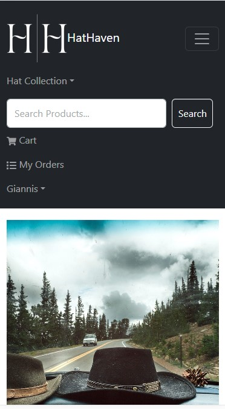

<h1>Hat Heaven Application README</h1>
<h2>Overview</h2>
Welcome to Hat Heaven, an innovative e-commerce web application dedicated to the sale of hats. Designed for both hat enthusiasts and store administrators, Hat Heaven simplifies the process of buying and managing a diverse range of hat styles online. This application is ideal for customers seeking a specialized, hassle-free hat shopping experience, and for admins operating a hat-focused e-commerce store.
<h2>Responsive Design</h2>
Hat Heaven boasts a responsive design, ensuring an optimal browsing experience on various devices. Whether you are shopping on a PC or browsing through your mobile, our interface adapts seamlessly to your device for a consistent and user-friendly experience.
<h2>Preview of Hat Heaven</h2>
Below are previews of Hat Heaven on different devices, showcasing our responsive, user-friendly interface and sleek design.

<h3>PC View:</h3>

<h3>Mobile View:</h3>

<h2>Key Features</h2>
<h3>User Features:</h3>
<ul>
    <li>Account Management: Easy login, registration, and logout process.</li>
    <li>Product Browsing: View a wide range of products with detailed descriptions. Includes an efficient pagination system for easy navigation through product lists</li>
    <li>Search Functionality: Powerful search feature allowing users to quickly find specific products based on keywords.</li>
    <li>Shopping Cart: Add products to your cart and manage them easily.</li>
    <li>Checkout: Secure checkout with PayPal integration.</li>
    <li>Review System: Leave reviews for products and read others' feedback.</li>
</ul>
<h3>Admin Features:</h3>
<ul>
    <li>Account Management: Easy login and logout process.</li>
    <li>Product Management: Add, delete, and update product listings.</li>
    <li>User Management: View all users and have the ability to delete accounts.</li>
    <li>Order Management: View all orders and update delivery statuses.</li>
</ul>
<h2>Technology Stack</h2>
<h3>Front-End</h3>
<ul>
    <li>React and Bootstrap: A dynamic interface built with React and Bootstrap for responsive design.</li>
    <li> Redux: For efficient management of global state and API calls.</li>
</ul>

<h3>Back-End</h3>
<ul>
    <li>Node.js with Express: A robust server-side framework.</li>
    <li>MongoDB with Mongo Atlas: Utilizing MongoDB for a scalable and efficient database hosted on Mongo Atlas.</li>
    <li>JWT Authentication: Implemented JSON Web Token (JWT) for secure and reliable user authentication.</li>
</ul>

<h2>Getting Started with Hat Heaven</h2>

<h3>MongoDB Setup</h3>

To fully utilize the Hat Heaven application, you need to set up a MongoDB database. Use MongoDB Atlas, which offers a managed MongoDB service. After setting up your account and cluster, create a new database and note your connection string (URI), which you will use in the application.

<h4>Update the .env File</h4>

Ensure your <code>.env</code> file includes the <code>MONGO_URI</code> key with the connection string to your MongoDB database:

<pre>MONGO_URI=your_connection_string_here</pre>

This allows the application to connect to your MongoDB database.

<h3>Database Schemas</h3>

The application uses MongoDB with Mongoose for data modeling. Below are the schemas defined for the application:

<h4>User Schema</h4>

The User schema manages user information and authentication.

<table>
  <thead>
    <tr>
      <th>Field</th>
      <th>Type</th>
      <th>Required</th>
      <th>Description</th>
    </tr>
  </thead>
  <tbody>
    <tr>
      <td>name</td>
      <td>String</td>
      <td>Yes</td>
      <td>The full name of the user.</td>
    </tr>
    <tr>
      <td>email</td>
      <td>String</td>
      <td>Yes</td>
      <td>The user's email address, used as a login identifier. Must be unique.</td>
    </tr>
    <tr>
      <td>password</td>
      <td>String</td>
      <td>Yes</td>
      <td>The user's password, stored in a hashed format for security.</td>
    </tr>
    <tr>
      <td>isAdmin</td>
      <td>Boolean</td>
      <td>Yes</td>
      <td>Indicates whether the user has administrative privileges. Defaults to false.</td>
    </tr>
  </tbody>
</table>

Additional methods include password comparison and pre-save hooks for password encryption using bcrypt.

<h4>Product Schema</h4>

The Product schema contains details about the items available for sale in the e-commerce platform.

<table>
  <thead>
    <tr>
      <th>Field</th>
      <th>Type</th>
      <th>Required</th>
      <th>Description</th>
    </tr>
  </thead>
  <tbody>
    <tr>
      <td>user</td>
      <td>ObjectId</td>
      <td>Yes</td>
      <td>Reference to the User who created the product.</td>
    </tr>
    <tr>
      <td>name</td>
      <td>String</td>
      <td>Yes</td>
      <td>Name of the product.</td>
    </tr>
    <tr>
      <td>image</td>
      <td>String</td>
      <td>Yes</td>
      <td>URL of the product image.</td>
    </tr>
    <tr>
      <td>brand</td>
      <td>String</td>
      <td>Yes</td>
      <td>Product brand.</td>
    </tr>
    <tr>
      <td>category</td>
      <td>String</td>
      <td>Yes</td>
      <td>Category of the product.</td>
    </tr>
    <tr>
      <td>description</td>
      <td>String</td>
      <td>Yes</td>
      <td>Detailed description of the product.</td>
    </tr>
    <tr>
      <td>reviews</td>
      <td>Array of Review</td>
      <td>No</td>
      <td>Collection of reviews for the product.</td>
    </tr>
    <tr>
      <td>rating</td>
      <td>Number</td>
      <td>Yes</td>
      <td>Average rating based on reviews. Defaults to 0.</td>
    </tr>
    <tr>
      <td>numReviews</td>
      <td>Number</td>
      <td>Yes</td>
      <td>Total number of reviews. Defaults to 0.</td>
    </tr>
    <tr>
      <td>price</td>
      <td>Number</td>
      <td>Yes</td>
      <td>Price of the product.</td>
    </tr>
    <tr>
      <td>countInStock</td>
      <td>Number</td>
      <td>Yes</td>
      <td>Inventory count. Defaults to 0.</td>
    </tr>
  </tbody>
</table>

<h4>Review Schema</h4>

The Review schema captures customer feedback for products.

<table>
  <thead>
    <tr>
      <th>Field</th>
      <th>Type</th>
      <th>Required</th>
      <th>Description</th>
    </tr>
  </thead>
  <tbody>
    <tr>
      <td>user</td>
      <td>ObjectId</td>
      <td>Yes</td>
      <td>Reference to the User who wrote the review.</td>
    </tr>
    <tr>
      <td>name</td>
      <td>String</td>
      <td>Yes</td>
      <td>Name of the reviewer.</td>
    </tr>
    <tr>
      <td>rating</td>
      <td>Number</td>
      <td>Yes</td>
      <td>Numerical rating given to the product.</td>
    </tr>
    <tr>
      <td>comment</td>
      <td>String</td>
      <td>Yes</td>
      <td>Textual comment describing the reviewer's experience.</td>
    </tr>
  </tbody>
</table>

<h4>Order Schema</h4>

The Order schema records the details of customer purchases.

<table>
  <thead>
    <tr>
      <th>Field</th>
      <th>Type</th>
      <th>Required</th>
      <th>Description</th>
    </tr>
  </thead>
  <tbody>
    <tr>
      <td>user</td>
      <td>ObjectId</td>
      <td>Yes</td>
      <td>Reference to the User who placed the order.</td>
    </tr>
    <tr>
      <td>orderItems</td>
      <td>Array</td>
      <td>Yes</td>
      <td>List of products ordered, each containing product details like name, quantity, and price.</td>
    </tr>
    <tr>
      <td>shippingAddress</td>
      <td>Object</td>
      <td>Yes</td>
      <td>Shipping address including street, city, postal code, and country.</td>
    </tr>
    <tr>
      <td>paymentMethod</td>
      <td>String</td>
      <td>Yes</td>
      <td>Method of payment used for the order.</td>
    </tr>
    <tr>
      <td>paymentResult</td>
      <td>Object</td>
      <td>No</td>
      <td>Details of the payment transaction returned by the payment gateway (e.g., PayPal).</td>
    </tr>
    <tr>
      <td>itemsPrice</td>
      <td>Number</td>
      <td>Yes</td>
      <td>Total price of all items ordered.</td>
    </tr>
    <tr>
      <td>taxPrice</td>
      <td>Number</td>
      <td>Yes</td>
      <td>Total tax applicable to the order.</td>
    </tr>
    <tr>
      <td>shippingPrice</td>
      <td>Number</td>
      <td>Yes</td>
      <td>Shipping cost for the order.</td>
    </tr>
    <tr>
      <td>totalPrice</td>
      <td>Number</td>
      <td>Yes</td>
      <td>Total cost of the order including items, tax, and shipping.</td>
    </tr>
    <tr>
      <td>isPaid</td>
      <td>Boolean</td>
      <td>Yes</td>
      <td>Status indicating whether the order has been paid. Defaults to false.</td>
    </tr>
    <tr>
      <td>paidAt</td>
      <td>Date</td>
      <td>No</td>
      <td>The date and time when the order was paid.</td>
    </tr>
    <tr>
      <td>isDelivered</td>
      <td>Boolean</td>
      <td>Yes</td>
      <td>Status indicating whether the order has been delivered. Defaults to false.</td>
    </tr>
    <tr>
      <td>deliveredAt</td>
      <td>Date</td>
      <td>No</td>
      <td>The date and time when the order was delivered.</td>
    </tr>
  </tbody>
</table>

All schemas include timestamps automatically added by Mongoose, noting when each document is created and last updated.

<h3>Database Setup</h3>
<ul>
    <li>Populate the Database: Use 'npm run data:import' in the root directory to import initial data into your MongoDB database.</li>
    <li>Clear the Database: Execute 'npm run data:destroy' to remove all data from your database, allowing for a fresh start.
    </li>
</ul>

<h3>Running the Application in Development</h3>
<ul>
    <li>Install Dependencies: Navigate to the root directory and install necessary dependencies:</li>
    <pre>npm install
cd frontend
npm install</pre>
    <li>Set Environment Variables: Create a .env file in your root directory based on example.env with appropriate values for the development environment.</li>
    <li>Start the Development Servers: Run both the frontend and backend servers concurrently:</li>
    <pre>npm run dev</pre>
</ul>
<h3>Running the Application in Production Using Docker</h3>
<ul>
    <li>Build the Docker Image:</li>
    <pre>docker build -t hatheaven:latest .</pre>
    <li>Create a Production .env File: Based on example.env, fill in production-appropriate values and save this file as .env in your project root. Ensure this file is not checked into version control.</li>
    <li>Run the Docker Container:</li>
    <pre>docker run -p 5000:5000 --env-file ./.env hatheaven:latest</pre>
</ul>

Hat Heaven offers a comprehensive e-commerce solution, combining user convenience with powerful administrative tools, all wrapped in a modern, responsive design.
