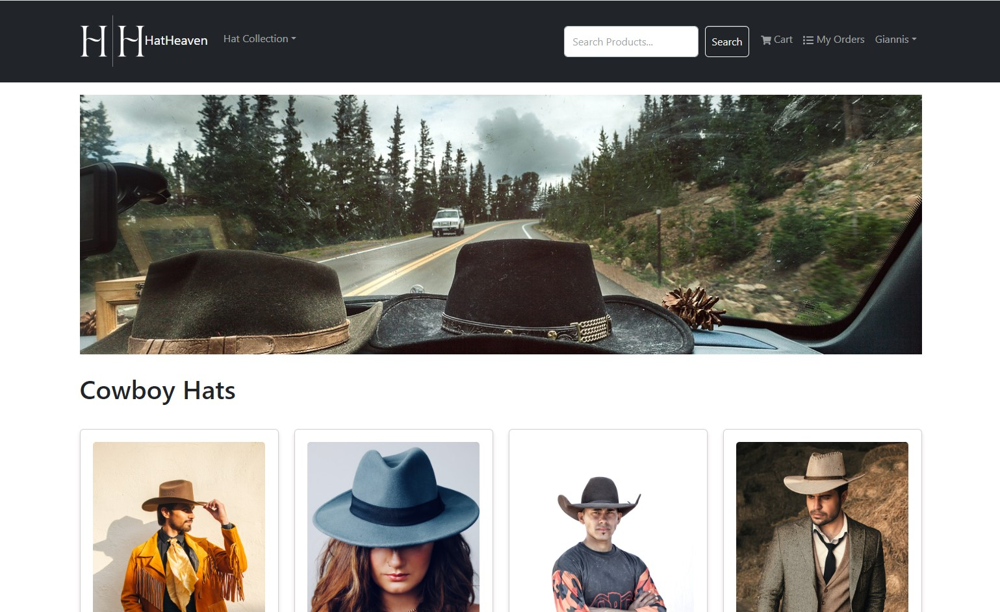
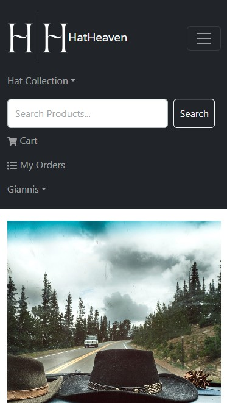

<h1>Hat Heaven Microservices Application</h1>

<h2>Overview</h2>

<strong>Hat Heaven</strong> is a modern e-commerce application dedicated to stylish hats. The project has evolved from a monolithic app to a <strong>microservices-based architecture</strong> to support scalability and maintainability.

<h2>Frontend Previews</h2>
Below are previews of Hat Heaven on different devices, showcasing our responsive, user-friendly interface and sleek design.

<h3>PC View:</h3>

<h3>Mobile View:</h3>

<h2>Key Features</h2>
<h3>User Features:</h3>
<ul>
    <li>Account Management: Easy login, registration, and logout process.</li>
    <li>Product Browsing: View a wide range of products with detailed descriptions. Includes an efficient pagination system for easy navigation through product lists</li>
    <li>Search Functionality: Powerful search feature allowing users to quickly find specific products based on keywords.</li>
    <li>Shopping Cart: Add products to your cart and manage them easily.</li>
    <li>Checkout: Secure checkout with PayPal integration.</li>
    <li>Review System: Leave reviews for products and read others' feedback.</li>
</ul>
<h3>Admin Features:</h3>
<ul>
    <li>Account Management: Easy login and logout process.</li>
    <li>Product Management: Add, delete, and update product listings.</li>
    <li>User Management: View all users and have the ability to delete accounts.</li>
    <li>Order Management: View all orders and update delivery statuses.</li>
</ul>
<h2>Technology Stack</h2>
<h3>Front-End</h3>
<ul>
    <li>React and Bootstrap: A dynamic interface built with React and Bootstrap for responsive design.</li>
    <li> Redux: For efficient management of global state and API calls.</li>
</ul>

<h3>Back-End</h3>
<ul>
    <li>Node.js with Express: A robust server-side framework.</li>
    <li>MongoDB: Utilizing MongoDB for a scalable and efficient database.</li>
    <li>JWT Authentication: Implemented JSON Web Token (JWT) for secure and reliable user authentication.</li>
</ul>

<h2>Microservices Architecture</h2>
<ul>
  <li><strong>Auth Service</strong>: Handles user registration, login, authentication, and user management.</li>
  <li><strong>Products Service</strong>: Manages product listings, product details, and user reviews.</li>
  <li><strong>Orders Service</strong>: Manages the order placement, payment, and status tracking.</li>
  <li><strong>Client Service</strong>: A React-based frontend that interacts with all backend services.</li>
</ul>

<h2>Event-Driven Communication</h2>

All services communicate asynchronously through a <strong>NATS Streaming Server</strong>. This facilitates event-driven architecture and loose coupling.

<h2>Shared Package</h2>

A reusable package <code>@hat-heaven/common</code> is used across all services to share logic like middleware, error handling, and event definitions. It is published to <a href="https://www.npmjs.com/package/@hat-heaven/common">npmjs.com</a>.

<h2>Running the Application Development Environment</h2>

The entire application runs on a Kubernetes cluster managed locally with <strong>Minikube</strong>. Development workflow is powered by <strong>Skaffold</strong> which automatically rebuilds and redeploys on code changes.

<h3>Prerequisites</h3>
<ul>
  <li><a href="https://www.docker.com/">Docker</a></li>
  <li><a href="https://minikube.sigs.k8s.io/">Minikube</a></li>
  <li><a href="https://skaffold.dev/">Skaffold</a></li>
</ul>

<h3>Start the Cluster</h3>
<ul>
<li>
  <pre>minikube start</pre>
</li>
<li>create ingress in minikube</li>
<li>create skaffold in minikube</li>
<li>
  Execute the imperative commands to the cluster to add secrets
  <pre>
- kubectl create secret generic jwt-secret --from-literal=JWT_SECRET={YOUR_SECRET}
- kubectl create secret generic paypal-secret --from-literal=PAYPAL_CLIENT_ID={YOUR_PAYPAL_CLIENT_ID} --from-literal=PAYPAL_APP_SECRET={YOUR_PAYPAL_APP_SECRET} --from-literal=PAYPAL_API_URL={YOUR_PAYPAL_API_URL}
  </pre>
</li>
<li>
move to the directory of hat-heaven
 
</li>
<li> start the skaffold
 <pre>skaffold dev</pre>
 </li>
 <li> create a tunnel
 <pre>kubectl port-forward -n ingress-nginx service/ingress-nginx-controller 8080:80</pre>
 </li>
  <li> Add the  a record to your hosts file
  <pre>127.0.0.1 hat-heaven.local</pre>
 </li>
</ul>

<h3>Access the Application</h3>
<pre>
hat-heaven.local:8080
</pre>

<h2>Production Deployment & CI/CD</h2>

The Hat Heaven application is also deployed to a production environment on <strong>AWS EKS (Elastic Kubernetes Service)</strong>. This setup is fully managed via infrastructure-as-code and GitOps principles.

<h3>Infrastructure as Code</h3>

All AWS cloud resources, including EKS cluster, networking, and security settings, are provisioned and managed using <strong>Terraform</strong>. You can find the code in the following repository:

<ul>
  <li>
    <a href="https://gitlab.com/Ioannis_Mich/infra-automation-eks" target="_blank">Hat Heaven Infrastructure (Terraform)</a>
  </li>
</ul>

<h3>GitOps Deployment</h3>

The production Kubernetes resources—such as Deployments, Services, Ingresses, and Secrets—are managed through a GitOps workflow using <strong>ArgoCD</strong>. These manifests are version-controlled in a dedicated repository:

<ul>
  <li>
    <a href="https://gitlab.com/Ioannis_Mich/hat-heaven-gitops" target="_blank">Hat Heaven GitOps (Kubernetes Resources)</a>
  </li>
</ul>

<h3>CI/CD Workflow</h3>

Continuous integration and deployment pipelines are used to automate:

<ul>
  <li>Docker image builds and pushes of all microservices</li>
  <li>Tagging and release management</li>
  <li>Automatic updates of Kubernetes manifests</li>
</ul>

This ensures that every code change can be tested, deployed, and monitored in a reliable, repeatable way.

<h2>Swagger Documentation</h2>
<ul>
  <li><code>/swagger/auth</code> – Auth endpoints</li>
  <li><code>/swagger/products</code> – Product and review endpoints</li>
  <li><code>/swagger/orders</code> – Order endpoints</li>
</ul>

<h3>Database Schemas</h3>

The application uses MongoDB with Mongoose for data modeling. Below are the schemas defined for the application:

<h4>User Schema</h4>

The User schema manages user information and authentication.

<table>
  <thead>
    <tr>
      <th>Field</th>
      <th>Type</th>
      <th>Required</th>
      <th>Description</th>
    </tr>
  </thead>
  <tbody>
    <tr>
      <td>name</td>
      <td>String</td>
      <td>Yes</td>
      <td>The full name of the user.</td>
    </tr>
    <tr>
      <td>email</td>
      <td>String</td>
      <td>Yes</td>
      <td>The user's email address, used as a login identifier. Must be unique.</td>
    </tr>
    <tr>
      <td>password</td>
      <td>String</td>
      <td>Yes</td>
      <td>The user's password, stored in a hashed format for security.</td>
    </tr>
    <tr>
      <td>isAdmin</td>
      <td>Boolean</td>
      <td>Yes</td>
      <td>Indicates whether the user has administrative privileges. Defaults to false.</td>
    </tr>
  </tbody>
</table>

Additional methods include password comparison and pre-save hooks for password encryption using bcrypt.

<h4>Product Schema</h4>

The Product schema contains details about the items available for sale in the e-commerce platform.

<table>
  <thead>
    <tr>
      <th>Field</th>
      <th>Type</th>
      <th>Required</th>
      <th>Description</th>
    </tr>
  </thead>
  <tbody>
    <tr>
      <td>user</td>
      <td>ObjectId</td>
      <td>Yes</td>
      <td>Reference to the User who created the product.</td>
    </tr>
    <tr>
      <td>name</td>
      <td>String</td>
      <td>Yes</td>
      <td>Name of the product.</td>
    </tr>
    <tr>
      <td>image</td>
      <td>String</td>
      <td>Yes</td>
      <td>URL of the product image.</td>
    </tr>
    <tr>
      <td>brand</td>
      <td>String</td>
      <td>Yes</td>
      <td>Product brand.</td>
    </tr>
    <tr>
      <td>category</td>
      <td>String</td>
      <td>Yes</td>
      <td>Category of the product.</td>
    </tr>
    <tr>
      <td>description</td>
      <td>String</td>
      <td>Yes</td>
      <td>Detailed description of the product.</td>
    </tr>
    <tr>
      <td>reviews</td>
      <td>Array of Review</td>
      <td>No</td>
      <td>Collection of reviews for the product.</td>
    </tr>
    <tr>
      <td>rating</td>
      <td>Number</td>
      <td>Yes</td>
      <td>Average rating based on reviews. Defaults to 0.</td>
    </tr>
    <tr>
      <td>numReviews</td>
      <td>Number</td>
      <td>Yes</td>
      <td>Total number of reviews. Defaults to 0.</td>
    </tr>
    <tr>
      <td>price</td>
      <td>Number</td>
      <td>Yes</td>
      <td>Price of the product.</td>
    </tr>
    <tr>
      <td>countInStock</td>
      <td>Number</td>
      <td>Yes</td>
      <td>Inventory count. Defaults to 0.</td>
    </tr>
  </tbody>
</table>

<h4>Review Schema</h4>

The Review schema captures customer feedback for products.

<table>
  <thead>
    <tr>
      <th>Field</th>
      <th>Type</th>
      <th>Required</th>
      <th>Description</th>
    </tr>
  </thead>
  <tbody>
    <tr>
      <td>user</td>
      <td>ObjectId</td>
      <td>Yes</td>
      <td>Reference to the User who wrote the review.</td>
    </tr>
    <tr>
      <td>name</td>
      <td>String</td>
      <td>Yes</td>
      <td>Name of the reviewer.</td>
    </tr>
    <tr>
      <td>rating</td>
      <td>Number</td>
      <td>Yes</td>
      <td>Numerical rating given to the product.</td>
    </tr>
    <tr>
      <td>comment</td>
      <td>String</td>
      <td>Yes</td>
      <td>Textual comment describing the reviewer's experience.</td>
    </tr>
  </tbody>
</table>

<h4>Order Schema</h4>

The Order schema records the details of customer purchases.

<table>
  <thead>
    <tr>
      <th>Field</th>
      <th>Type</th>
      <th>Required</th>
      <th>Description</th>
    </tr>
  </thead>
  <tbody>
    <tr>
      <td>user</td>
      <td>ObjectId</td>
      <td>Yes</td>
      <td>Reference to the User who placed the order.</td>
    </tr>
    <tr>
      <td>orderItems</td>
      <td>Array</td>
      <td>Yes</td>
      <td>List of products ordered, each containing product details like name, quantity, and price.</td>
    </tr>
    <tr>
      <td>shippingAddress</td>
      <td>Object</td>
      <td>Yes</td>
      <td>Shipping address including street, city, postal code, and country.</td>
    </tr>
    <tr>
      <td>paymentMethod</td>
      <td>String</td>
      <td>Yes</td>
      <td>Method of payment used for the order.</td>
    </tr>
    <tr>
      <td>paymentResult</td>
      <td>Object</td>
      <td>No</td>
      <td>Details of the payment transaction returned by the payment gateway (e.g., PayPal).</td>
    </tr>
    <tr>
      <td>itemsPrice</td>
      <td>Number</td>
      <td>Yes</td>
      <td>Total price of all items ordered.</td>
    </tr>
    <tr>
      <td>taxPrice</td>
      <td>Number</td>
      <td>Yes</td>
      <td>Total tax applicable to the order.</td>
    </tr>
    <tr>
      <td>shippingPrice</td>
      <td>Number</td>
      <td>Yes</td>
      <td>Shipping cost for the order.</td>
    </tr>
    <tr>
      <td>totalPrice</td>
      <td>Number</td>
      <td>Yes</td>
      <td>Total cost of the order including items, tax, and shipping.</td>
    </tr>
    <tr>
      <td>isPaid</td>
      <td>Boolean</td>
      <td>Yes</td>
      <td>Status indicating whether the order has been paid. Defaults to false.</td>
    </tr>
    <tr>
      <td>paidAt</td>
      <td>Date</td>
      <td>No</td>
      <td>The date and time when the order was paid.</td>
    </tr>
    <tr>
      <td>isDelivered</td>
      <td>Boolean</td>
      <td>Yes</td>
      <td>Status indicating whether the order has been delivered. Defaults to false.</td>
    </tr>
    <tr>
      <td>deliveredAt</td>
      <td>Date</td>
      <td>No</td>
      <td>The date and time when the order was delivered.</td>
    </tr>
  </tbody>
</table>

All schemas include timestamps automatically added by Mongoose, noting when each document is created and last updated.

<h2>Conclusion</h2>

Hat Heaven demonstrates how e-commerce platforms can be architected for modern development using microservices, event-driven design, and cloud-native tooling.

